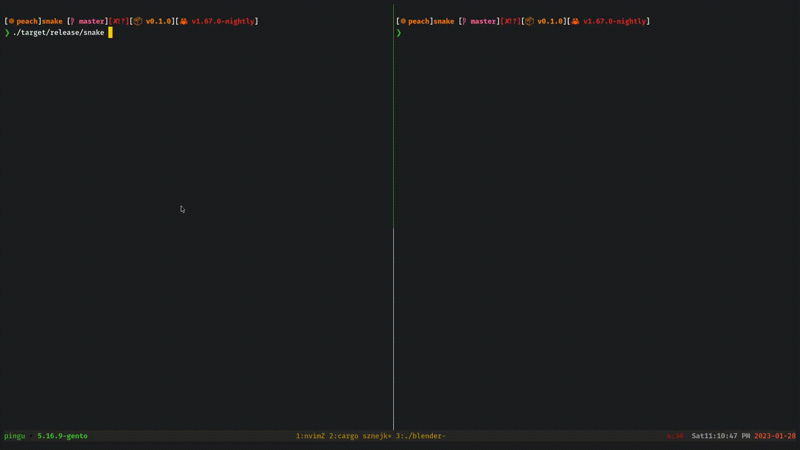

# Snake API

## Description
You may recall this classic game from old Nokias. 

### How does it work

Server starts on *localhost:8080*

|method|path|role|
|---|---|---|
|GET|/snake|Returns current state of the whole game board, which consists of walls, snake and fruits. It is returned as a text, nothing fancy|
|POST|/snake/:direction|Allows to change direction of the snake. Snake moves every n seconds (by default 1 frame per 100 milliseconds). :direction specyfies in which direction we want snake to rotate, it can be one of: *left*, *right*, *up*, *down*. In case of commanding snake to rotate in more that 1 direction in move, which is not the opposite of the current one, the direction will be drawn from the requested pool with repetitions.|

* Eating a fruit increases length of the snake
* Moving into a wall, makes snake come out from the opposite wall
* Bitting a body results in loss and restarts the game

### Board 
Game board in returned in such a format:

```
┌────────────────────────────────────────┐
│                                        │
│                                        │
│                                        │
│                                        │
│                                        │
│ O                                      │
│                                        │
│         @#####                         │
│                                        │
│                                        │
│                                        │
│                  O                     │
│                                        │
│                                        │
│                                        │
│                                        │
│                  O                     │
│                                        │
│                                        │
│                                        │
└────────────────────────────────────────┘
```

#### Legend
|symbol|meaning|
|--|--|
|@| Head of the snake|
|#| Body of the snake|
|\|| Wall|
|O| Fruit|


## How to run

### Requirements
Unallocated port 8080

### Start server
Starting backend HTTP server (actix_web server + game)
```
cargo run --release
```

### Interface
In order to implement your own interface you will need to use previously mentioned 2 endpoints for communication with the server.

### Example
However there is and example `./examples/terminal_client.rs` which basically allows to play from terminal. 

Steering:
|key|function|
|--|--|
|l|move right|
|k|move up|
|j|move down|
|h|move left|
|q|exit|

```
cargo run --example terminal_client
```

## Demo

